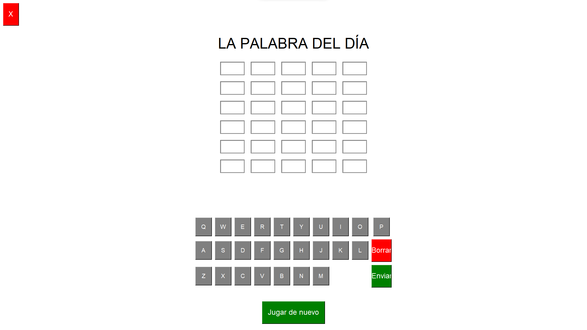

# STRINGLE - Juego de Adivinanza de Palabras

## Descripción
STRINGLE es un juego de adivinanza de palabras inspirado en el famoso juego Wordle. El objetivo es adivinar una palabra secreta de 5 letras en un número limitado de intentos.
Cada intento proporciona retroalimentación sobre qué letras son correctas y si están en la posición correcta o incorrecta, ayudándote a acercarte a la respuesta final.

## Características
- Palabras de 5 letras
- 6 intentos para adivinar la palabra secreta.
- Indicaciones en colores:
-   Verde: Letra correcta en la posición correcta.
-   Amarillo: Letra correcta pero en la posición incorrecta.
-   Gris: Letra incorrecta.
- Modo oscuro y claro dependiendo de la hora:
- Modo oscuro: Activo entre las 20:00 y las 6:00.
- Modo claro: Activo entre las 6:00 y las 20:00.
- Soporte de teclado virtual en la interfaz para facilitar el ingreso de letras.
- Validaciones estrictas:
- Solo permite letras.
- La palabra debe tener una longitud exacta de 5 caracteres.
- No se permite el ingreso de números ni caracteres especiales.
- Solo se permiten palabras que están en la lista de palabras posibles.

## Preview


## Requisitos del Sistema
- Python 3.x
Librerías adicionales:
- tkinter (preinstalado en la mayoría de distribuciones de Python)
- HtmlTestRunner (para generar informes HTML de las pruebas)

## Instalación
1. **Clona el repositorio o descarga los archivos:**

   ```bash
   git clone <URL_DEL_REPOSITORIO>
   cd stringle

2. **Instala las dependencias necesarias. En la mayoría de las distribuciones de Python, tkinter ya está preinstalado.
Sin embargo, en algunas distribuciones de Linux podrías necesitar instalarlo manualmente:**

   ```bash
   sudo apt-get install python3-tk
   pip install HtmlTestRunner

3. **Ejecución del Juego
Para iniciar el juego, ejecuta el archivo main.py:**

   ```bash
   python3 TPO11.py

4. **Ejecución de Pruebas
Para correr las pruebas y generar un informe en HTML, ejecuta Test_Validaciones.py:**

   ```bash
   python3 test_stringle.py

## Changelog

### [v2.3.0] - 10-11-2024
- **Correcciones PEP 8:** Ajustes en el código para cumplir con el estándar de estilo de Python PEP 8.
- **Ajustes en apariencia y usabilidad:** Mejoras en la apariencia de la interfaz y correcciones de estilo visual.
- **Traducción de variables:** Cambios en los nombres de las variables al inglés para mayor consistencia y claridad.
- **Botón "Jugar de nuevo":** Ajuste del botón para reiniciar el juego correctamente.
- **Corrección de pop-up al finalizar intentos:** Se corrige el comportamiento del mensaje emergente al agotarse los intentos del jugador.
- 
### [v2.2.1] - 28-10-2024
- **Correcciones varias:** Ajustes menores en el código para mejorar la limpieza y eficiencia del código.
- **Corrección de múltiples caracteres:** Solución de errores relacionados con el ingreso de múltiples caracteres a la vez.
- **Mejoras en Tkinter:** Optimización de la funcionalidad de Tkinter para un rendimiento y apariencia mejorados.
- **Reportes de pruebas unitarias en HTML:** Implementación de reportes en HTML para las pruebas unitarias.
- **Modo noche:** Incorporación de un modo noche para reducir el cansancio visual.
- **Ajuste de colores:** Cambios en la paleta de colores para una apariencia más agradable y accesible.

### [v2.2.0] - 21-10-2024
- **Separación de pruebas unitarias:** Organización de las pruebas unitarias en módulos separados.
- **Instrucciones y botón "Jugar de nuevo":** Se añaden instrucciones y se agrega la funcionalidad del botón "Jugar de nuevo".
- **Actualización y corrección de pruebas unitarias:** Revisiones y correcciones en las pruebas unitarias para asegurar su correcta ejecución.

### [v2.1.2] - 14-10-2024
- **Corrección de backspace e ingreso de caracteres:** Se ajusta la funcionalidad del backspace y la validación de caracteres ingresados.
- **Botón de salida:** Botón de salida para cerrar la aplicación correctamente.
- **Comentarios en español:** Se agregan comentarios en español para una mejor comprensión del código por parte del equipo.

### [v2.1.1] - 07-10-2024
- **Arreglo de input inválido:** Corrección de errores en la entrada de datos para mejorar la robustez y prevenir inputs no válidos.
- **Validación de inputs:** Implementación de validaciones adicionales en los campos de entrada para asegurar la integridad de los datos.
- **Mejoras en Tkinter:** Ajustes en la interfaz desarrollada en Tkinter para optimizar la usabilidad y la consistencia visual.

### [v2.1.0] - 04-10-2024
- **Implementación:** Se implementa la libreria Tkinter para realizar una interfaz de usuario mas atractiva.

### [v2.0.1] - 30-09-2024
- **Ampliación:** Se amplia el diccionario de palabras.

### [v2.0.0] - 17-09-2024
- **Implementación:** Se implementa un archivo que verifica que la palabra ingresada este dentro de un diccionario.

### [v1.4.2] - 16-09-2024
- **Mejoras:** Mejoras entorno a la interfaz del usuario.

### [v1.4.1] - 15-09-2024
- **Cambios:** Cambios menores a la modularización y correcta utilización de los emojis.

### [v1.4.0] - 11-09-2024
- **Archivos:** Se crea el archivo "Funciones.py" donde se agregan las funciones del código y se separan del código principal.

### [v1.3.1] - 10-09-2024
- **README:** Se crea el archivo README para proporcionar al usuario mayor información acerca del proyecto.
- **Mejoras:** Mejoras con Pep8.

### [v1.3.0] - 09-09-2024
- **Emojis:** Se importan emojis que se muestran en consola para mayor calidad visual.
- **Cambios:** Cambios menores a la modularización y mas mejoras con Pep8.

### [v1.2.1] - 03-09-2024
- **Mejora:** Se utiliza Pep8 para cumplir con la pautas de estilo propuestos por la misma.
- 
### [v1.2.0] - 02-09-2024
- **Nueva Funcionalidad:** Se agregó la opción de finalizar el juego al ingresar `-1`.
- **Comentarios:** Se implementan comentarios para que el usuario comprenda el codigo fuente.
- **Mejora:** Mejoras en la validación de la entrada del usuario.
- - **Mejora:** Añadido soporte para eliminar tildes en las palabras de entrada.

### [v1.1.0] - 31-08-2024
- **Nueva Funcionalidad:** Colores en la consola usando `colorama`.
- **Lógica principal:** Se implementa la lógica principal del juego.

### [v1.0.0] - 26-08-2024
- **Lanzamiento inicial:** Implementación básica del juego.

- ***Gracias por jugar Stringle***
